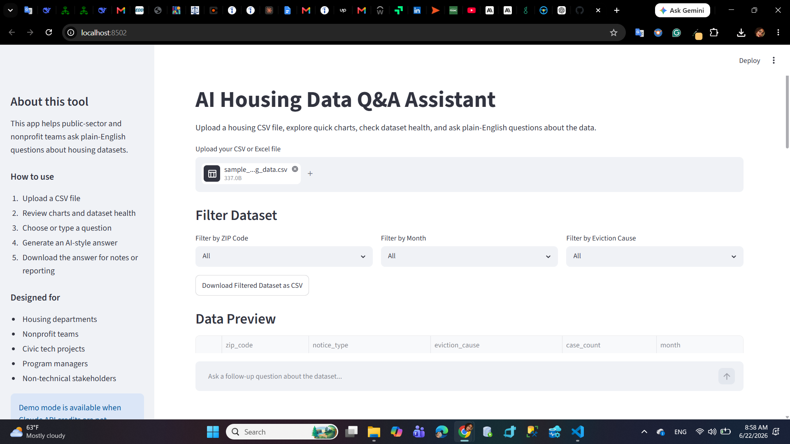
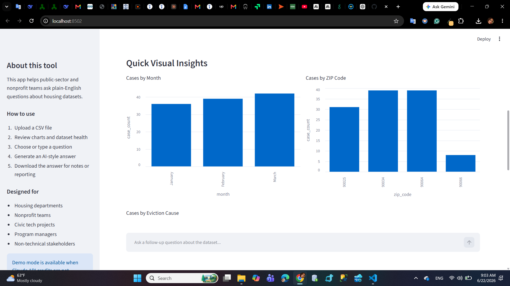
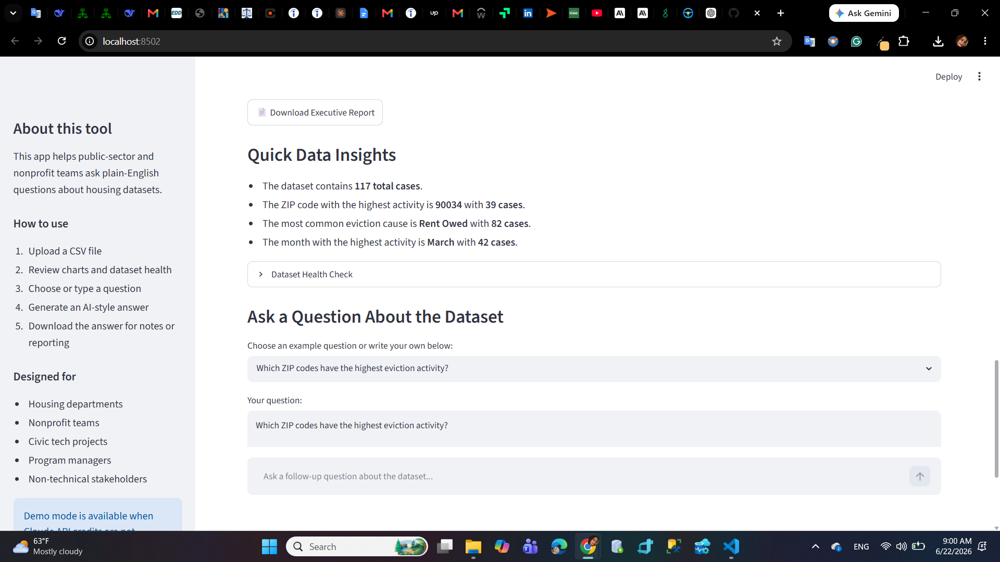
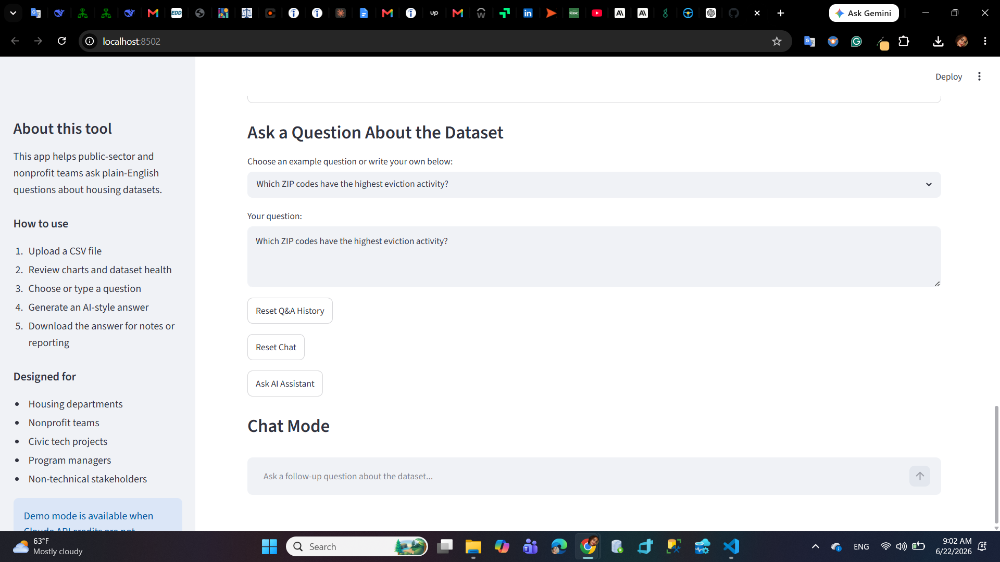

# AI Housing Data Q&A Assistant

AI-powered data assistant that allows users to upload housing datasets, explore trends, generate insights, and ask plain-English questions about the data.

Built with Python, Streamlit, Pandas, Plotly, and Claude API.

---

## Features

- Upload CSV datasets
- Interactive filtering by ZIP code, month, and eviction cause
- Dataset health check
- Interactive charts and visualizations
- Quick data insights
- Executive summary generation
- Ask natural language questions about the dataset
- Chat mode with follow-up questions
- Download answers as TXT
- Download answers as PDF
- Download filtered dataset as CSV
- Executive report generation

---

## Technologies

- Python
- Streamlit
- Pandas
- Plotly
- FPDF
- Python-dotenv
- Anthropic Claude API

---

## Screenshots

### Dashboard Overview



---

### Quick Insights



---

### Q&A History and Chat Mode



---

### Export Reports



---

## Project Structure

```
ai-housing-data-qa-assistant/
│
├── screenshots/
├── sample_data/
├── app.py
├── requirements.txt
├── .env.example
├── .gitignore
├── README.md
```

---

## Installation

Clone repository:

```bash
git clone https://github.com/Elliemnia/ai-housing-data-qa-assistant.git
```

Move into folder:

```bash
cd ai-housing-data-qa-assistant
```

Install dependencies:

```bash
pip install -r requirements.txt
```

Run application:

```bash
streamlit run app.py
```

---

## Example Questions

- Which ZIP code has the highest activity?
- Which eviction cause appears most frequently?
- Which month has the highest number of cases?
- Summarize trends by month.
- What should housing program managers focus on first?

---

## Future Improvements

- Connect to live Claude API
- Multiple dataset support
- SQLite database integration
- Dashboard analytics
- Authentication system
- Export charts to PDF

---

## Author

**Ellie Nia**

Data Analytics | Python | SQL | Power BI

GitHub:

https://github.com/Elliemnia
